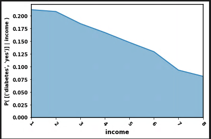
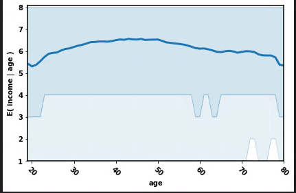
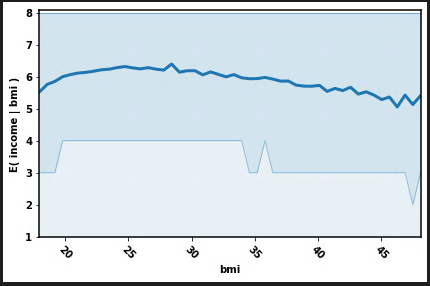
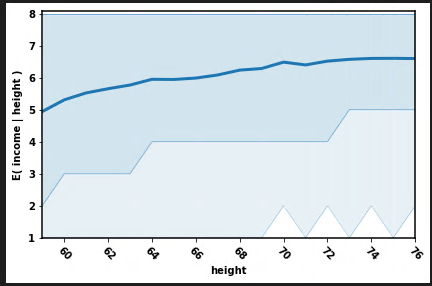
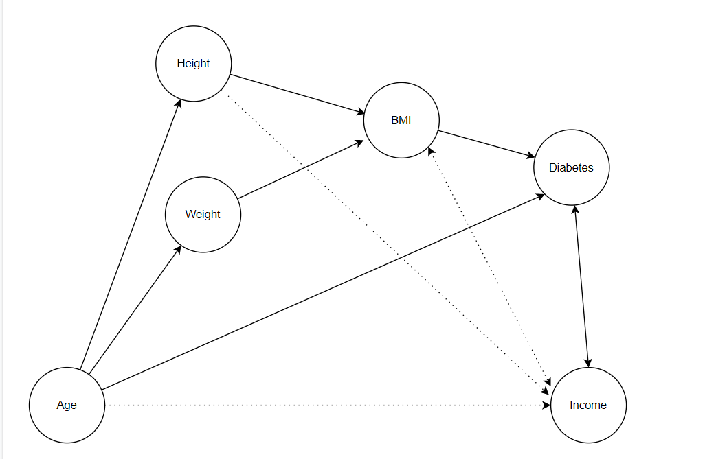
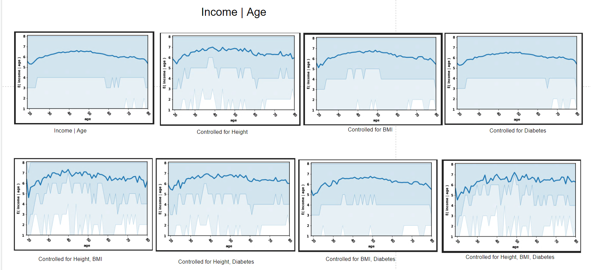
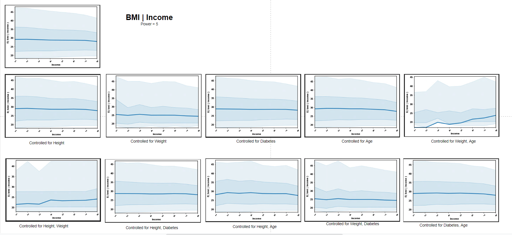
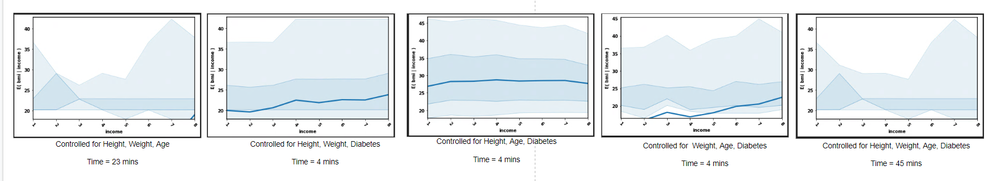
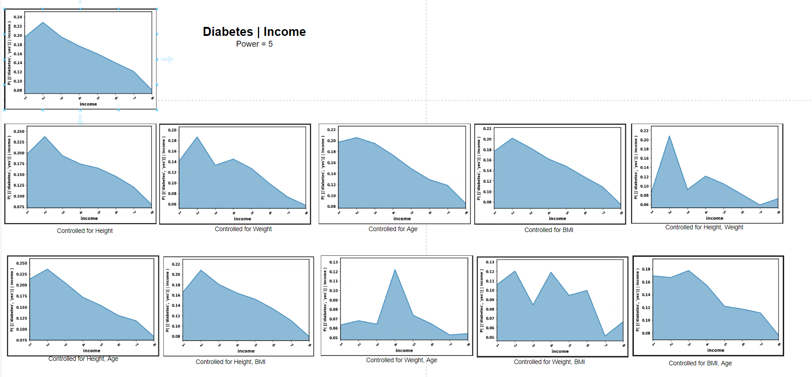
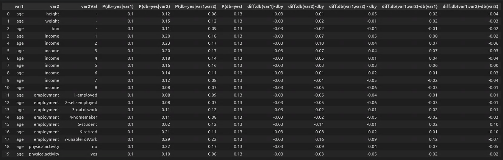

[HOME](https://arungaonkar.github.io/HPCC-Causality/) **|**
[Timeline](https://arungaonkar.github.io/HPCC-Causality/index.html#timeline) **|**
[Previous Week](https://arungaonkar.github.io/HPCC-Causality/week9.html) **|**
[Next Week](https://arungaonkar.github.io/HPCC-Causality/week11.html)

---

# Monday 07/25

I have continued to analyze the dataset by plotting some more graphs. I thought of including the income variable in the hypothesis. And diabetes depends on income, the plot is shown below. As the income goes high, the probability of diabetes goes low. They are negatively correlated.

In terms of causality, it is not clear that, whether diabetes is causing the income or higher income is causing the cure of diabetes and thereby lowering diabetes. To find that, I have to control one variable and find the effect of other variables.

Some correlation between age and income can be observed in the below plot. Even from bmi vs income and height vs income, the correlation can be found.

  

After a discussion with Roger, we were able to draw the following hypothesis model:

Height and Weight both cause BMI and BMI, in turn, causes Diabetes. Age is affecting both Height and Weight, hence the above diagram. The effect of Age on income is not clear. Similarly the height and BMI on Income. The dotted line indicates between height and income implies that there is a relation but is not exactly sure about it. The arrow in both directions indicates that the direction of relation is not clear.

# Tuesday 07/26

To draw the relationship between income and age, I tried to plot the expectation value of Income conditioned on Age, controlled for different variables. From the following figure, we can infer that there is a direct effect of age on income.

To get the directionality between BMI and Age, I followed the same procedure as above.

My observation from this would be that weight has a higher effect on BMI than height. Controlling for Diabetes and age does not affect BMI  Income.

# Wednesday 07/27

To find the direction of the relation between diabetes and income, I have decided to control one variable and find the effect of other variables.

The probability of diabetes conditioned on income is decreasing as the income increases.

![diabetes_income_combined_part2]

From the above plots, it is evident enough to draw a conclusive relationship between diabetes and income.

# Thursday 07/28 & Friday 07/29

I have done some more pre-processing for the dataset. such as,

1. I have removed 'unknown' values in variables in maritaldetails, employment etc.

2. Added **physicalactivity** column - yes, no [whether they are having physical activities after regular work hours?]

3. Added **insurance** column - yes, no [Are you enrolled in a health coverage plan?]

4. Added **checkup** column - [ About how long it has been since they last visited a doctor for a routine checkup? Values are: '1-in1-Year', '2-in2-Years', '3-in5-Years', '4-5orMore-Years'

5. Added **nohospitalcost** column - [Was there a time in the past 12 months when you needed to see a doctor but could not because of cost?]  [no, yes]

6. Resampled weight values to nearest 10th values.

After this preprocessing, the dataset is of size 290759 rows with 32 columns.

Some of the observations that I made from statistical analysis are as follows:

Looking at the distribution of variables,

* Around 87% of the surveyed people have no diabetes

* Around 53% of the people are the age 55 and above in ageGroup (5,6)

* 1/3rd of surveyed people are overweight. (around 36%)

* Around 44% of the people participating in the survey are employed.

* 38% of the surveyed people have income over 75000 per annum. (around 38%)

Looking at the pairwise relationship of variables with diabetes,

* As the income increased, the effect of conditioning the income on diabetes decreased.

* Students have lesser prone to diabetes, while retired people and those who are unable to work are having higher chances of diabetes.

* The difference between the people who have diabetes and those who do not have diabetes is 12%.

* 22% of the people without physical activities are having diabetes.

* Diabetes and Age are positively correlated. The probability of diabetes increases with the age.

* Diabetes and Weight are positively correlated. As weight increases, the probability of diabetes increases.

* The probability of diabetes is not affected by conditioning on Height.

* Diabetes and BMI are positively correlated. As BMI increases, the probability of diabetes increases.

* Diabetes and Income are negatively correlated. As income increases, the probability of diabetes increases.

* Students have lesser prone to diabetes, while retired people and those who are unable to work are having higher chances of diabetes.

* People who are not able to work are having 16% higher chance of diabetes.

* Retired people have an 8% higher chance of diabetes.

* 22% of the people who are not doing any physical activities are having diabetes which is 12% more than the people who are doing physical activities.

I have also tried to observe the effect of these variables on diabetes.

* The expected Age of people with diabetes is 64 and for those without diabetes, it is 53.

* The height difference between the people with diabetes and without diabetes is not significant. (0.17 inches)

* People with diabetes weigh 23 pounds more than those without diabetes.

* People with diabetes have a higher BMI of 3.8 more than people without diabetes.

* The difference between the average income of all people and that of the average income of people with diabetes is quite significant. (0.7)

* The expected income of people without diabetes is above 50000 per annum.

* Most of the people with diabetes are retired people, while employees cover most of the surveyed people, it is that category of people where diabetes is not expected much.

* Physical activity seems like biased data. Around 80% of surveyed people said they are doing some type of physical activity.

After that, I started to look at the pairwise conditioned effect of variables on diabetes. And for diabetes conditioned on Age, and the second variable is chosen on the fly, the probability of diabetes is as follows.

I have to follow a similar approach and observe the effect of conditionalizing the direct causal effect of variables on diabetes.

---
[HOME](https://arungaonkar.github.io/HPCC-Causality/) **|**
[Timeline](https://arungaonkar.github.io/HPCC-Causality/index.html#timeline) **|**
[Previous Week](https://arungaonkar.github.io/HPCC-Causality/week9.html) **|**
[Next Week](https://arungaonkar.github.io/HPCC-Causality/week11.html)
