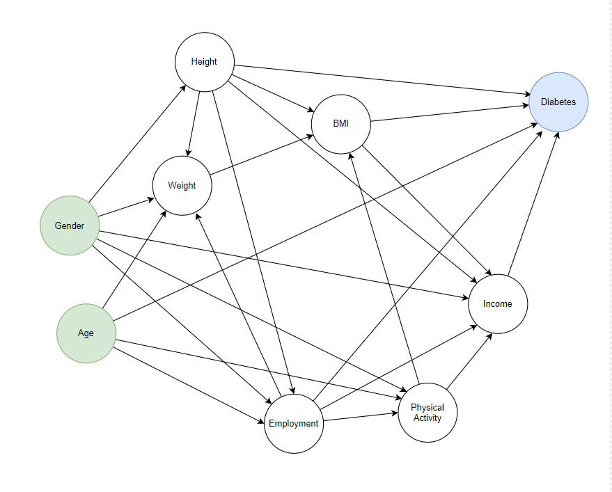
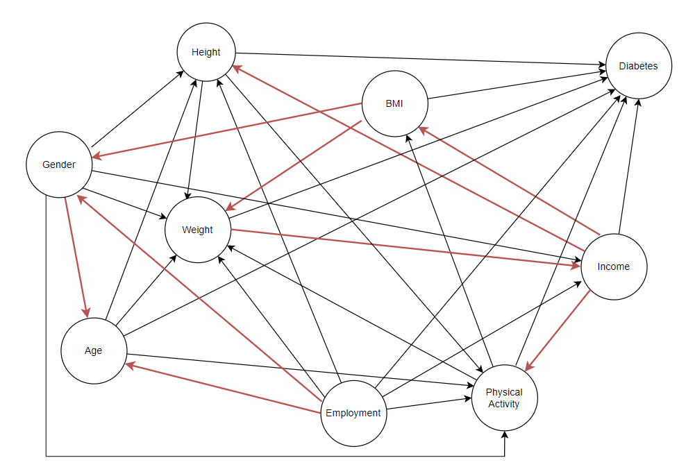

[HOME](https://arungaonkar.github.io/HPCC-Causality/) **|**
[Timeline](https://arungaonkar.github.io/HPCC-Causality/index.html#timeline) **|**
[Previous Week](https://arungaonkar.github.io/HPCC-Causality/week10.html) **|**
[Next Week](https://arungaonkar.github.io/HPCC-Causality/week12.html)

---

# Monday 08/01 & Tuesday 08/02

In the analysis BMI Category was missing, so I have included it in the further analysis.

I have continued to analyze the effect of the conditionalization of other variables on the probability of diabetes. And some observations are written below.

1. Even if a person maintains a constant weight, the risk of diabetes increases as age progresses.

2. Conditionalized on Height, the probability of diabetes increases for people who are not doing any physical activities by 8%, and when conditionalized on Age, it increased by 4%.

3. If the height of the person is low (<65), as the weight increases the probability of diabetes escalates quickly. This indicates a positive correlation between height and weight. This also explains the higher risk of diabetes for extremely obese people.

4. Overweight people with low income have the highest probability of diabetes among different incomes and weights.

5. People with weight over 200 pounds, do not seems to have their BMI under 30. In other words, they are not under 'normal' BMI conditions.

# Wednesday 08/03

Found some discrepancies in the dataset. 'Drinks' seems to have some strange discontinuities. So I have decided to revisit the pre-processing file and make some modifications.

1. I have filtered out all 'unknown' and 'refused' values.

2. I have removed one column, 'ASTHMANOW' as this was a sub-question and had over 242000 null values.

3. recalculated 'drinks' values.

4. mapped 'childcount' to numbers

5. The dataset is of size 279922, 31

# Thursday 08/04

I have started analyzing intermediate variables and observed a few interesting patterns and results.

1. Age and height seem to be correlated. The age of surveyed people is above 18 and at the ages between 70-80, the average height decreases. So the causal direction is not clear between Age and Height.

2. Different types of employment have different expected height, age, weight and BMI.

3. Age and physical activity are correlated. The expected age of the people who are doing physical activity is 53 and those who are not doing the physical activity are 58.

4. Middle-aged people are having a higher income than younger people. Retired people are having a lesser income. Age and income are correlated. Even though it seems to be true that age causes income, since causality does not imply causation, it is not clear.

5. As Height increased, weight also increased. They are correlated and it can be also true that Height causes weight.

6. Height should cause BMI, as BMI is inversely related to the square of height. [calculated using height]. But no such correlation is observed.

7. As height increased, the income also increased. They are correlated but the causal direction is not clear.

8. The expected height of the Male is 70 inches, while for females it is 64 inches. So it can be said that gender can cause age.

Analyzing these relations and plots, the following preliminary model can be drawn.

# Friday 08/05

I have started to test and analyze each variable with other variables on testDirections to find the causal direction of the variables. And the following causal model can be drawn.

To look at the direct effect of age on diabetes, I have to block all the other paths from age to diabetes. By controlling for 'weight', 'height', 'physicalactivity', 'BMI', 'gender', 'income', I can find the direct path from age to diabetes.

For age to income, even if the paths are blocked by controlling for 'employment', 'weight', 'gender', some dependencies are still there. One possible inference is that in the real world there will be micro-dependencies, which are very difficult to identify and explain.

In the next week, I have to find the effect of each variable by blocking the path to the other variable and thereby reducing the model.

---

[HOME](https://arungaonkar.github.io/HPCC-Causality/) **|**
[Timeline](https://arungaonkar.github.io/HPCC-Causality/index.html#timeline) **|**
[Previous Week](https://arungaonkar.github.io/HPCC-Causality/week10.html) **|**
[Next Week](https://arungaonkar.github.io/HPCC-Causality/week12.html)
