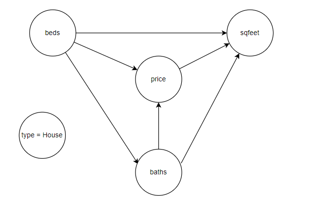
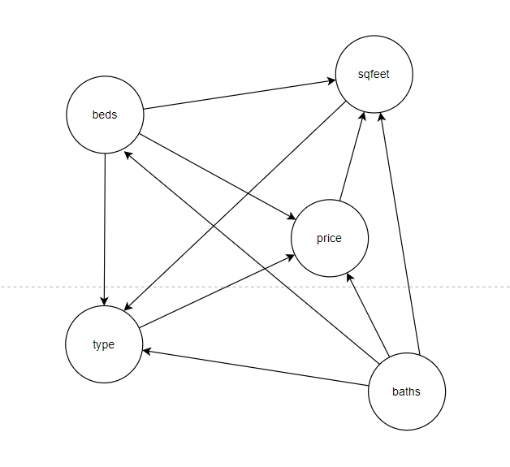

[HOME](https://arungaonkar.github.io/HPCC-Causality/) **|**
[Timeline](https://arungaonkar.github.io/HPCC-Causality/index.html#timeline) **|**
[Previous Week](https://arungaonkar.github.io/HPCC-Causality/week12.html)

---

This was my last week of internship, I worked on making a poster, and a 5-minute video presentation.

Analysis of the housing dataset seemed to have concluded. Based on the testDirection and independence test, all the variables are dependent on each other. But for the 'house' type, the causal model can be drawn like this:

When all the types are included, the causal model is:

The poster can be found [here](Poster_ArunGaonkar.pdf).

Here is the youtube video link for the 5-minute video presentation. [https://www.youtube.com/watch?v=bMrFX5SyYbU](https://www.youtube.com/watch?v=bMrFX5SyYbU)

---

[HOME](https://arungaonkar.github.io/HPCC-Causality/) **|**
[Timeline](https://arungaonkar.github.io/HPCC-Causality/index.html#timeline) **|**
[Previous Week](https://arungaonkar.github.io/HPCC-Causality/week12.html)