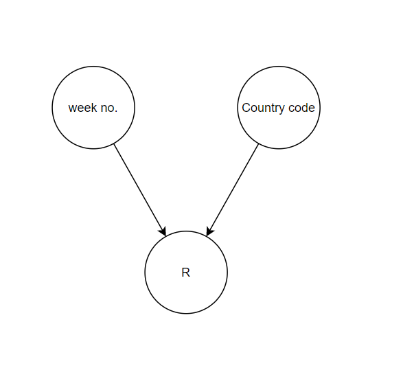
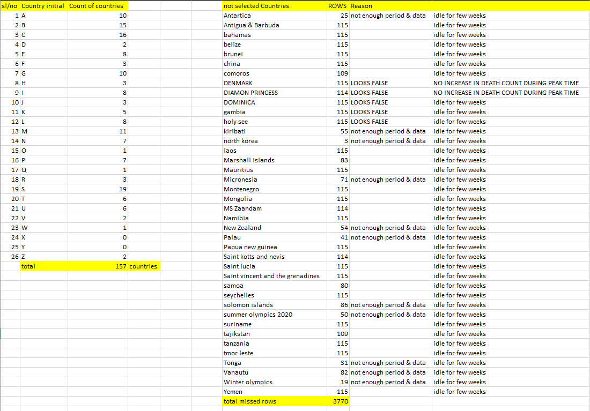

[HOME](https://arungaonkar.github.io/HPCC-Causality/) |
[Timeline](https://arungaonkar.github.io/HPCC-Causality/index.html#timeline) |
[Previous Week](https://arungaonkar.github.io/HPCC-Causality/week1.html) |
[Next Week](https://arungaonkar.github.io/HPCC-Causality/week3.html)

---

# Tuesday 05/31
I have continued testing the models. I was trying to understand the probability testing where I had found some problems. I had a meeting with Lorraine, in which I am told to complete the security training, setting up the LexisNexis email-id and also to maintain the Fieldglass timesheets.

In the team meeting, I have proposed 2 hypotheses for the COVID19 dataset.

1. The effect of vaccination on testing positive for covid 19 again.
2. the effect of weather on covid 19.

Hypothesis 1 has been discarded due to vaccination data and secondary testing result data were not available. Vaccination data had few information only which would not suffice the hypothesis requirements.

Hypothesis 2 was approved. And some modifications are suggested. Such as,

* I can consider variables like temperature, humidity, wind speed, month, and latitude
* Breakdown seasonality by month (discrete) and latitude (continuous variable)
* R is a function of latitude and week of the year
* include the delay of 2-3 weeks in the model as the R value is delayed by test result time.

In the team meeting, we have the checked the working of the setup in my machine. No faults were found.

After the meeting, I was looking at the modifications in the hypothesis and was finding a way to include those. I was asked to draft the hypothesis with relevant data and propose it.

# Wednesday 06/01

I have decided to read research papers on the causality effect of weather on COVID19 infection rate. I found multiple research papers and read 4 of them.

In his research, Ganslmeier, M. et.al. concludes that temperature and windspeed have robust negative effect on the spread. And in another study conducted by Yogesh Gupta et.al.  it is found that temperature, sunlight hours, and wind speed have significant impact on the spread of COVID-19 and deaths, but humidity does not affect coronavirus confirmed cases and deaths significantly. But Heibati B. et.al. presents that there is no association between daily temperature and incidence rate of COVID-19. In the research, Aidoo, Eric N et al, concluded that wind speed and pressure have a positive linear relationship with the risk of spread of COVID-19 whilst temperature and humidity have a non-linear relationship with the spread of COVID-19. So, it is quite unclear that what is the effect of weather parameters like temperature and humidity on the spread of COVID-19

Including all these I drafted the hypothesis proposal and submitted to Roger. I also started to test the model in the causal hypothesis. I was trying to understand the results from the testing the causal discovery of models.

# Thursday 06/02

Roger has provided suggestions on improving the hypothesis. I was working towards the suggestions on the causal hypothesis proposal.

In the team meeting, I was briefed about suggestions :

* Find a way to test the relationships?
* Include some intervention queries
* Find a method for validating the model and the type of causal metrics
* Look at other dataset -- house pricing dataset, so we can build on at least one of the hypotheses.

I have decided to keep only week number, country (or latitude, can ignore longitude as it won't affect much) and R for the causal model. I have received the access to the COVID19 dataset. But not able to spray it into my cluster. I was looking at the COVID19 dataset and found few inconsistencies. Some countries were not reporting the actual COVID19 data, so decided to remove such countries.

I have built a sample causal model for the above hypothesis. And it is a V-model.

# Friday 06/03

I was able to spray the dataset to my cluster. I was searching for another dataset to test the causality. I have found the [Boston housing dataset](https://www.kaggle.com/competitions/house-prices-advanced-regression-techniques/data). I came up with two hypotheses for this dataset.

* Hypothesis 1: The effect of month on the selling price of the house
In which month the house is sold the price is the highest? and in which month the price is at the least? Can we observe the trend in the selling price of the house in a year?
* Hypothesis 2: The number of rooms and the location has a positive effect on the selling price of the house. As the number of rooms increases, the selling price of the house increases. It may also be the case that the location of the house increases the selling price.

After careful analysis of the whole COVID19 dataset, going through 22000 rows, I had filtered 40 countries. Later I had sprayed the COVID19 dataset into the cluster.

<!--  -->

---
[HOME](https://arungaonkar.github.io/HPCC-Causality/) |
[Timeline](https://arungaonkar.github.io/HPCC-Causality/index.html#timeline) |
[Previous Week](https://arungaonkar.github.io/HPCC-Causality/week1.html) |
[Next Week](https://arungaonkar.github.io/HPCC-Causality/week3.html)
