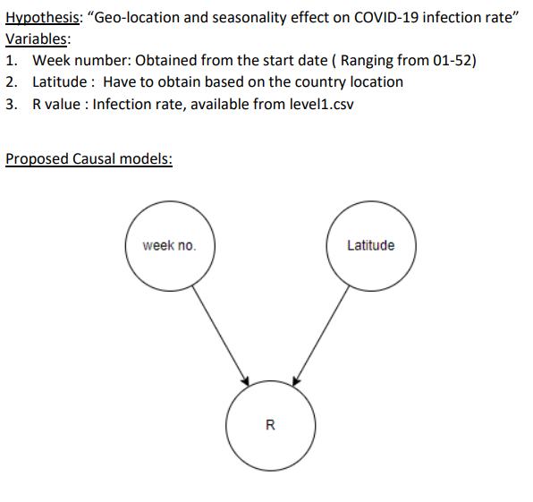
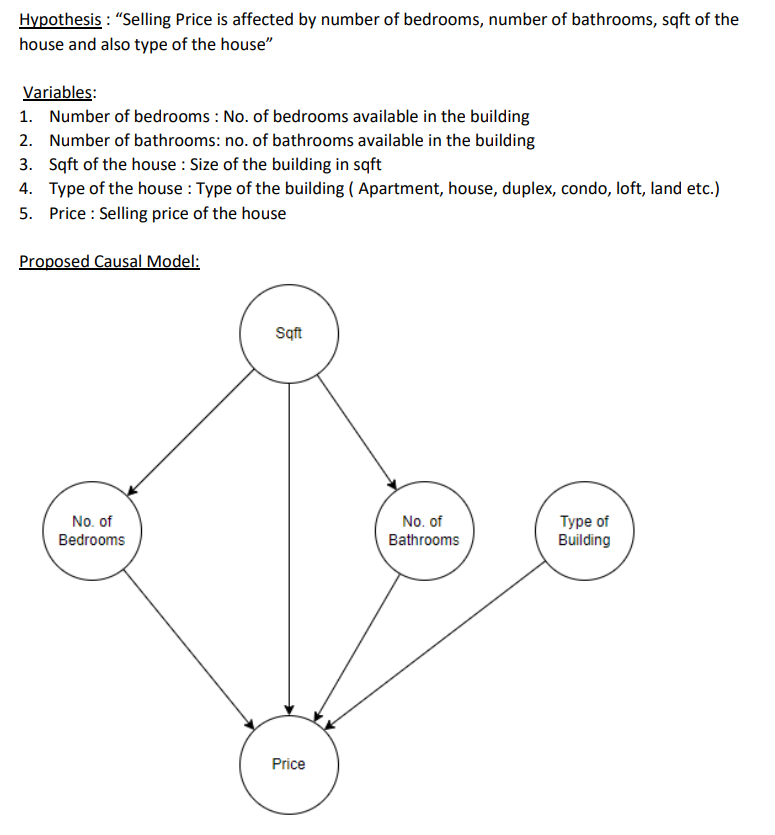

[HOME](https://arungaonkar.github.io/HPCC-Causality/) **|**
[Timeline](https://arungaonkar.github.io/HPCC-Causality/index.html#timeline) **|**
[Previous Week](https://arungaonkar.github.io/HPCC-Causality/week2.html) **|**
[Next Week](https://arungaonkar.github.io/HPCC-Causality/week4.html)

---

# Monday 06/06

The Boston housing dataset from Kaggle has only 1460 rows, which seems less for causality analysis. So I found another housing [dataset](https://www.kaggle.com/datasets/austinreese/usa-housing-listings) which has 384977 listings with 22 columns, which includes

* price data
* latitude
* longitude
* number of bedrooms
* number of bathrooms
* square footage of the house
* state
* type of house (apartment, condo, house etc.)

Since original hypothesis was based on the intuition and it holds true for this dataset as well.
So change in the hypothesis was not required. I started learning to write code in ECL. Also started ECL training from LexisNexis - Introduction to Enterprise Control Language.

# Tuesday 06/07

I have continued the tutorials on ECL from LexisNexis.

In the Team meeting with Roger and Zheyu from 1130-1230, we discussed the hypothesis and the data. The following suggestions were made:

1. Include square footage in the hypothesis of Housing dataset, as it is a function of number of bedrooms and bathrooms.
2. I should send the updated hypothesis of both the dataset.
3. I have to prioritize on ProAgrica Scheme as it may take some time to get the data.
4. Roger had cleared my doubt on Causal Discovery of model testing.
5. I am also asked to find a way to include week number ranging from 1 to 52 for the COVID19 dataset, so that I can keep track of which week refers to which season.
6. Roger suggested that instead of the country code, include the discretized latitude. If I can find that in the dataset, include it otherwise, I have to find the latitudes manually and add to the dataset.

After the meeting I have [updated the hypothesis](https://arungaonkar.github.io/HPCC-Causality/HypothesisProposal.pdf) for both the dataset (COVID and Housing) and sent it to Roger.

Figure below shows the sample causal model for the COVID dataset.

Figure below shows the sample causal model for Housing dataset.

# Wednesday 06/08

I have continued tutorials on ECL from LexisNexis. I started coding and was able to read the data from the dataset. Since the file size is 30 Mb, I am not able to get all the rows. Default size is 4MB, and hard limit is 10 MB. So I should find a way to read 30 MB file.

I was facing some issue when I tried to spray the dataset files to the local cluster. When I tried running the synthTest, I got this error,

`Code 1303,System error: 1303: RoxieMemMgr: Unable to create heap`

# Thursday 06/09

I have received ProAgrica Data and I was asked to find 3-10 variables that can be used to build a causal model and apply the toolkit on AgX dataset.

I have also received the latitude and longitude data for countries(world.flat) and US counties(us.flat). But in the World file, there are multiple latitude and longitude entries for the same country, having entries for multiple states. So I have got the doubt of which entry to consider for the causal model.

When I tried to upload the file into my cluster, uploading was getting failed because of less disk space. I am seeing 100% usage on thor, hthor, roxie, etc. clusters. Is it because of low memory? I have downloaded the dataset on my VM, which consumed all the disk space, due to which I was not able upload file.

There was an event "Intern Chat" organized by Lorraine for the interns to meet each others.

1. It was a privilege's to meet other interns and few LexisNexis employees as well.
2. Getting to know what is happening at 'HPCC Systems' and what other interns are working on was a great experience.

Later in the team meeting I had discussed the issues that I found with Roger.

1. For the COVID-19 dataset, with multiple values of latitude and longitude, we discussed multiple ways to get a single value latitude. Taking the first entry was not ideal choice and so median. Hence, we have decided to use the mean of the latitude of different states of the country for an entry date.
2. Regarding uploading the files to the cluster and failing the SynthTest, Roger helped me to find the issue. It was the disk space issue. So, I tried to increase the disk size of VM. It took around 2 hours to resolve the issue of expanding the disk. Now I have expanded the disk from 13GB to 52GB.
3. In-order to reduce complexity in the Causal model for the housing dataset, we decided to ignore the dependency of Housing type on the number of bedrooms and bathrooms and also the square footage.

When reading the level1.csv (COVID-19 dataset) file, I have decided to reach out to Hugo for the additional instructions. I also wanted to ask which is the most suitable file type (flat vs csv) for playing with the data.

# Friday 06/10

I began examining the AgX dataset because they (ProAgrica.com) may take some time to release the data we requested. As a result, it was deemed more important. I'm having trouble hypothesizing the data because it contains over 8000 attributes. I've compiled a list of characteristics for which I believe I can intuitively connect them. However, this is taking longer than I anticipated.

---

[HOME](https://arungaonkar.github.io/HPCC-Causality/) **|**
[Timeline](https://arungaonkar.github.io/HPCC-Causality/index.html#timeline) **|**
[Previous Week](https://arungaonkar.github.io/HPCC-Causality/week2.html) **|**
[Next Week](https://arungaonkar.github.io/HPCC-Causality/week4.html)
