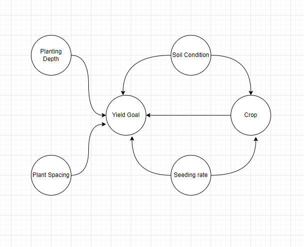
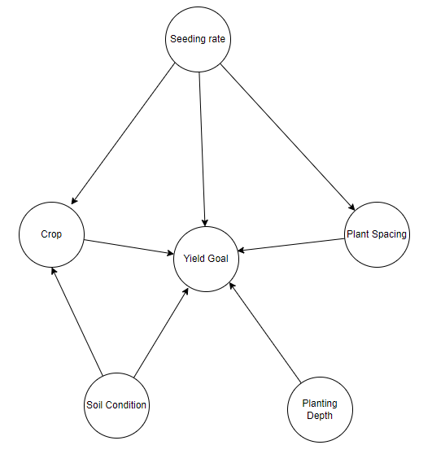
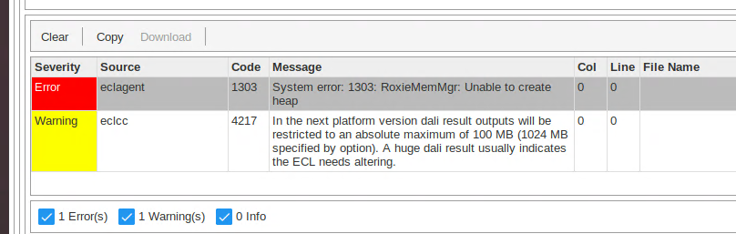

[HOME](https://arungaonkar.github.io/HPCC-Causality/) |
[Timeline](https://arungaonkar.github.io/HPCC-Causality/index.html#timeline) |
[Previous Week](https://arungaonkar.github.io/HPCC-Causality/week3.html) |
[Next Week](https://arungaonkar.github.io/HPCC-Causality/week5.html)

---

# Monday 06/13

It's a fresh start of the week. I am going through the AgX dataset and built causal models for that.

The thought process behind this model can be explained as follows:

In this model, does *Plant Spacing* and *Planting Depth* will have any effect the *Yield Goal* of the crop? If distance between two plants is less, it might reduce the sunlight reachability, and if the spacing is too much, there will be irredundant waste of space. So I am going to include the distance between two plants in the model. And about, planting depth is obvious as, if the depth is extra, the seeds might not be able to germinate because of lack of water and sunlight, excess heat.

Different type of crops are more suitable in different soil conditions. Based on this I assumed that *Soil condition* affects the yield goal, depending on the type of *crop*.

According to the dataset definition sheet, *Seeding rate* is the amount of seeds, plants, or trees being planted per acre. It depends on plant spacing, but what about crop? Does the number of trees/ seeds planted per acre depends on the crop type? Considering this second model is built as shown below.

After this I have to discuss with Roger to choose the best model and for any suggestions.

# Tuesday 06/14

In the AgX dataset, *Soil Condition* is an ordinal variable. So I wanted to discuss with Roger, is it better to encode and use it in the model or will it be hindering the prediction?

For covid19 model, I am thinking of finding a way to include week number ranging from 1 to 52 for the COVID19 dataset, so that I can keep track of which week refers to which season.

In the Team meeting, we have discussed the following:

* Yield goal is a expected goal value, it is an estimation. So it is not the ideal choice for causal model.
* Crop affects the seed rate, so I have to reverse the direction between crop and seeding rate.
* I should look for a definitive variable to include in the hypothesis. So these causal models have been discarded.
* Latest version of *because* module has been pushed, so I can continue testing the models and use for causality analysis.
* I have been asked to proceed with any one of the dataset to apply causality. So I have decided to go with Housing dataset to find a relationship between variables.

I was facing some issue with spraying the housing dataset file, Getting this error:

`Failed: End of UTF record not found (wrong record terminator defined or need to increase maxRecordSize?) after processing 26476757 bytes!`.

Once I have resolved this error, I started reading the housing dataset and verified the datatypes of each variable.

# Wednesday 06/15

I have started analyzing the housing dataset and have observed following.

1. There are 1307 values for which 'price' is 0.
2. There are 1036 rows for which 'sqfeet' is less than 120. (120 is the the minimum square footage for a house. Ref: [worldpopulationreview.com](https://worldpopulationreview.com/state-rankings/minimum-house-size-by-state#:~:text=The%20minimum%20square%20footage%20for%20a%20house%20is%20120%20square%20feet))
3. There are 3107 rows for which 'baths' is 0.
4. There are 10978 rows for which 'beds' is 0.
5. There is no entry for which both 'beds' and 'bath' are 0.

I had setup meeting with Hugo to clarify some issues and doubts with ECL. In this meeting I have learnt about Data patterns and how can I get to know best suitable variable type for each variable in the dataset. Along with that I have also understood the importance of typing the exact variable type of each variable.

I have found outliers in the dataset. So I wanted to know what is the reasonable house size in sqfeet, below which I can delete the rows.

While using the dataset in coding, I have found that I am not able to display all the rows of the dataset. This is because of the restrictions in the ECL memory management.

# Thursday 06/16

To display all the data of the dataset, I can use

`#OPTION('outputLimitMb','nn'); where nn is the number of MBs`.

but there is a upper limit 100MBs for the ECL memory management. Even with the maxSize of 100MBs, I was not able to read all the data. But then I realized, there is no need to display all the data.

In the team meeting with Roger and Zheyu,
Roger helped me to understand how to incorporate the causality toolkit from the *because* module which is in python , with the ECL Language to apply for a dataset. Transforming, Normalizing functions were discussed.

Further analyzing the data, I have found few outliers in the dataset. For eg., The max value of the price was $2,768,307,249 for an *Apartment* with 2 beds & 1.5 baths located at Columbus, seems an outlier. Similarly, max size of the house was *8,388,607 sqfeet*, which is larger than Hawaii, having only 2 beds and 1 bath, and guess the cost of this apartment located in *Mankato, MN*. It is as cheap as it can be and at *$750* ( If you guessed it correctly, give me a call. LOL). This is an erroneous data, might have caused during the data entry.

So I have decided to apply this filter.

1. **500 <= Price <= 10000**, Assuming that the reasonable price for a house lies between that range.
2. **300 <= Square Feet <= 1200**, Assuming that the reasonable square footage for a house worth accommodating lies between that range.

# Friday 06/17

I have worked on cleaning the dataset.  

When applying *Normalize* function, I have found it cannot be applied directly to the *types* variables as it a *STRING* type. So I am finding ECL method to convert the *types* variables to *NUMERIC* type by encoding ( 1=apartment, 2=house, 3=condo etc). For this I have found *ENUM function*, but when applied with the sample example given in the documentation, I am facing the error.

Also I have to apply the filtering option of selecting only required columns out of the whole dataset.

Along with that I have looked at few tutorial videos on ECL coding from LexisNexis. And the Probability module in HPCC_Causality toolkit, which helps in applying different functions. I have found an error in HPCC_Causality 'continuousTest.ell' file when understanding the implementation of Probability testing.

---

[HOME](https://arungaonkar.github.io/HPCC-Causality/) |
[Timeline](https://arungaonkar.github.io/HPCC-Causality/index.html#timeline) |
[Previous Week](https://arungaonkar.github.io/HPCC-Causality/week3.html) |
[Next Week](https://arungaonkar.github.io/HPCC-Causality/week5.html)
