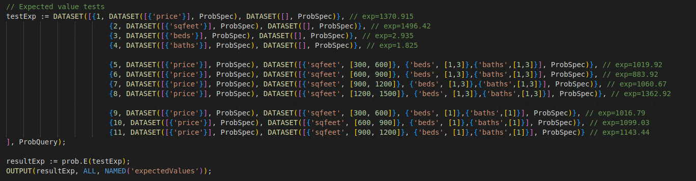
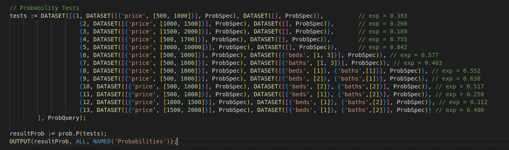
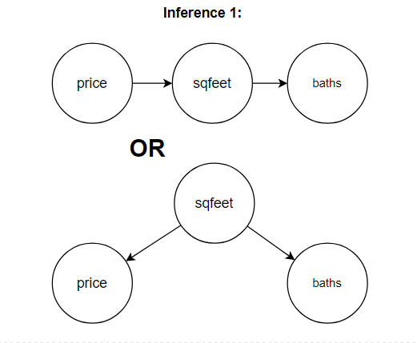
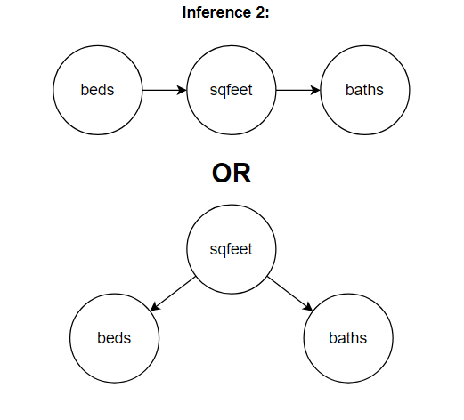
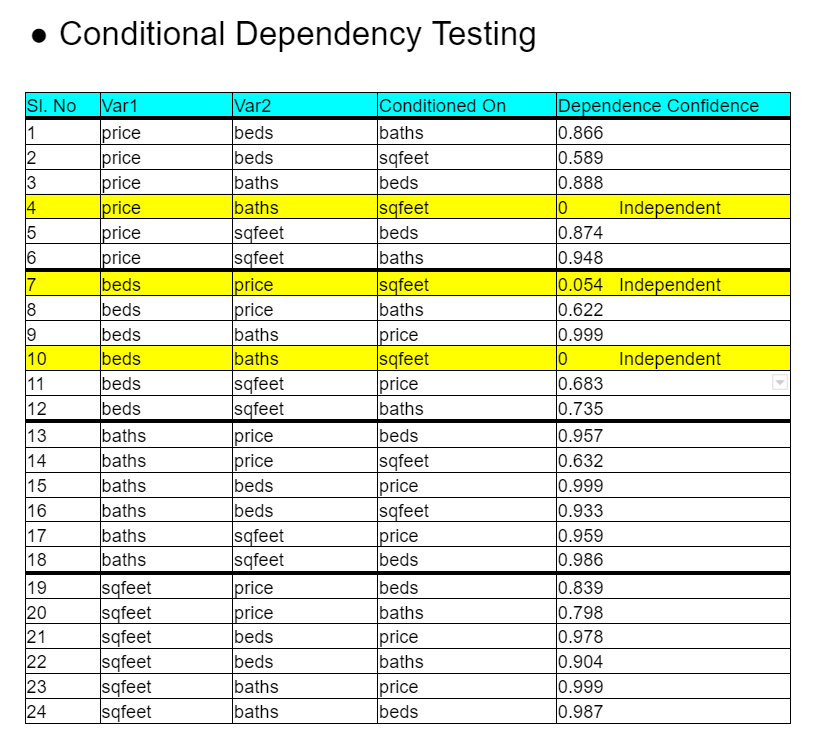
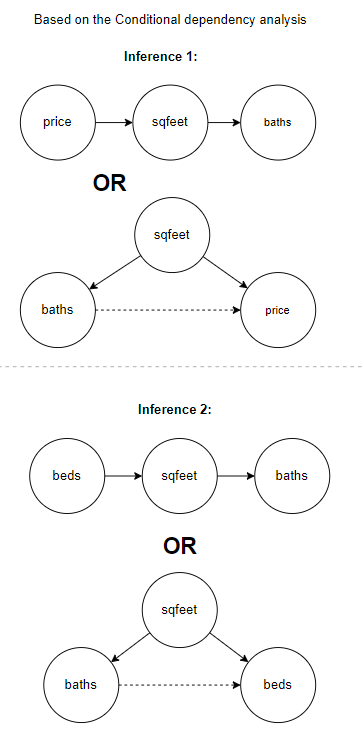
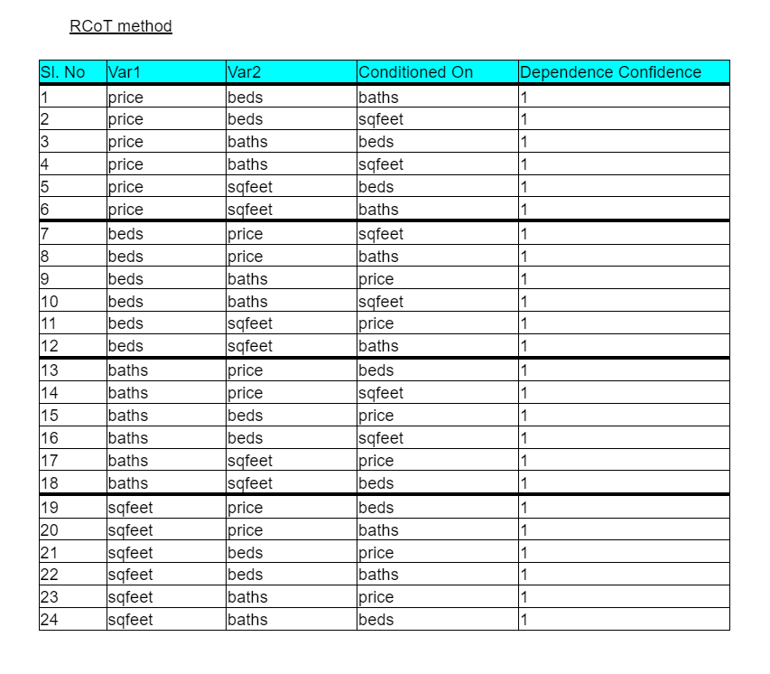
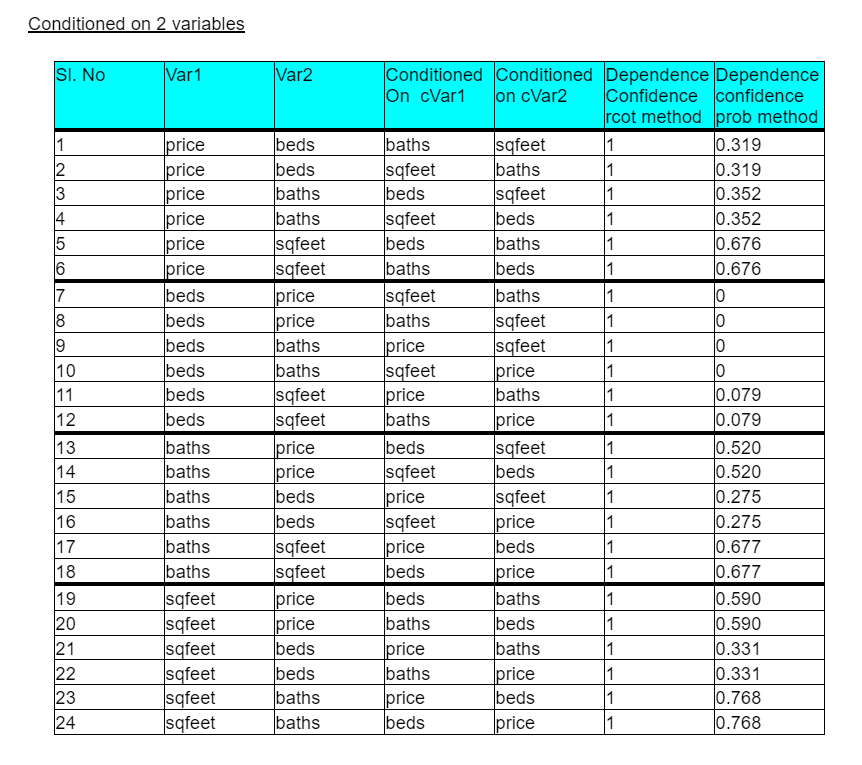

[HOME](https://arungaonkar.github.io/HPCC-Causality/) **|**
[Timeline](https://arungaonkar.github.io/HPCC-Causality/index.html#timeline) **|**
[Previous Week](https://arungaonkar.github.io/HPCC-Causality/week4.html) **|**
[Next Week](https://arungaonkar.github.io/HPCC-Causality/week6.html)

---

# Monday 06/20

A fantastic morning to start with. In a meeting with Roger and Gordon, we discussed how to visualize the graphs. We have also discussed Observable JavaScript and ECL notebook and visualizing graphs there. After that meeting, Roger and I have decided to, for the time being, let's focus on the only type of house in the 'housing' dataset and continue the analysis. To convert the 'Type' of the housing dataset to the numeric data format, Roger suggested me use LabelEncoder from ML_Core. I have reported the error that I have faced in 'ContinuousTest.ecl' of the HPCC_Causality bundle.

I have started analyzing the probability distribution and dependency of variables in the 'housing' dataset. I have found that 75% of the *house*s have a price in the range of $500-$1700. And only 4% of the houses lie in the range from $3000-$10000. Some of the probability observations have been made.

Expectation Value testing:

Some Probability and conditional probability observations have been made.

And I am unable to visualize the probability distribution of variables.

# Tuesday 06/21

I have continued to analyze the dependency of variables in the 'housing' dataset. For the dependency testing between *price* and *sqfeet*, the execution took 3hr35mins. Other variables like *Beds* and *Baths* are found to be highly dependent on each other with a confidence of *0.99*. *Bath* and *Beds* are dependent on *sqfeet* as well with the confidence of 0.63 and 0.59 respectively.

After that, I tried Independence testing for each variable respectively which took about 4 hrs. to complete. And result says that all are dependent on each other.

# Wednesday 06/22

I have asked Roger why the dependence test and independence test is taking longer time. Then we decided to debug the issue in python. We resolved the issue by making some changes in the *because* module.

After that, I have done conditional independence testing, where I have chosen one variable for conditioning. Looking at the results I have made 2 inferences.

Since *price* and *baths* are conditionally independent of given sqfeet, it has to follow either *chain* model or *inverted V* model as shown.

Similarly *beds* and *baths* are conditioned on *sqfeet*.

A conflict in the conditional independence results has been found.

1. *beds* and *price* are independent given *sqfeet*. [confidence is 0.054]
2. *price* and *beds* are dependent given *sqfeet*. [confidence is 0.589]

In this case how to conclude from the results?

# Thursday 06/23

I have tested the dataset for conditional independence and found these results. Using 'prob' test methods,  I found that there is no symmetry in the results.

This was the updated inference from the above table.

Conditionally (A, B &#124; C) should be the same as (B, A &#124; C), this was violated in the conditional dependency tests. So In the team meeting, it was discussed, and later we pair programmed to add the 'rcot' testing method to the HPCC_Causality bundle. 

I have raised a Pull Request to the HPCC_Causality bundle for including the *rcot* method for testing conditionality dependencies.

# Friday 06/24

I have tested conditionality dependencies using *rcot* method and found the following results.

I have tested conditionality independencies for variables of housing dataset conditioned on 2 variables using both *prob* and *rcot* methods. I have found some interesting results like both methods giving different results for a few queries.

Using *rcot* method I have found that all are dependent but using *prob* method few are not.

But no proper conclusions can be drawn.

---

[HOME](https://arungaonkar.github.io/HPCC-Causality/) **|**
[Timeline](https://arungaonkar.github.io/HPCC-Causality/index.html#timeline) **|**
[Previous Week](https://arungaonkar.github.io/HPCC-Causality/week4.html) **|**
[Next Week](https://arungaonkar.github.io/HPCC-Causality/week6.html)
