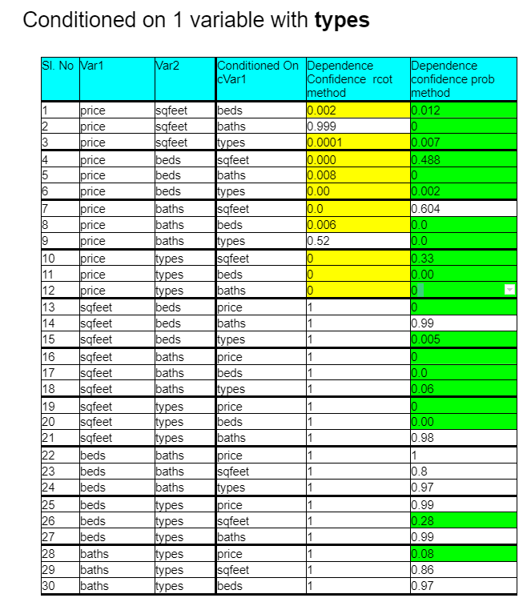

[HOME](https://arungaonkar.github.io/HPCC-Causality/) **|**
[Timeline](https://arungaonkar.github.io/HPCC-Causality/index.html#timeline) **|**
[Previous Week](https://arungaonkar.github.io/HPCC-Causality/week5.html) **|**
[Next Week](https://arungaonkar.github.io/HPCC-Causality/week7.html)

---

# Monday 06/27

In 1:1 meeting with Roger, we have started working on the makeGrid module. Since I was not able to draw any conclusions from the conditionality test results, I was asked to do CausalDiscovery on the data to see if there are any causal relationships between the variables.

I faced another error in the CausalDiscovery, that pointed to cScan.py of *because* module, but the error log was leading to the dead end, may be because of, as later pointed out by Roger, memory overflow or something similar. But solving this issue, we found few modifications that has to be done at Causality bundle. After making those changes I have raised the pull request.

Based on the results of the CausalDiscovery, I was able to draw the following the causal model.


But logically speaking, this model is not fitting the real-world case. so we have decided to look deeper into the model and dataset.

Some issues that I found today are:

1. When I combined the probTest with causal tests, why is it taking longer time to complete? but individually taking lesser than a minute?

2. Even with the same dataset and same code, executing multiple times, I am getting different models. What is the reason?

# Tuesday 06/28

In a team meeting, I asked the reason for different results of the CausalDiscovery for same code and data on different executions. Roger pointed out to use the seed in the Causality toolkit to make the results consistent. But even after using the seed, I was getting different results.

I wanted to include 'types' variable in the housing analysis, but this was of string type, so I had to encode it. But to learn this I was re-implementing the LabelEncoder example from the ML_Core test folder. But there was an issue in importing the library. I had set up meeting with Lili to figure out the issues with LabelEncoder from ML_Core bundle.

I have started working on the grid module.

# Wednesday 06/29

I have received the update from Lili on the LabelEncoder issue. the fix at ML_Core bundle has solved the issue in labelEncoder.

I have started learning more ECL language and its features from Introduction to ECL Part 2 course from LexisNexis. I have continued working on the grid module.

# Thursday 06/30

I have stated analyzing the AgX record schema for possible hypothesis. I found a hypothesis which is as follows.

```text
Depending on the type of the crop, will the large seeds affects the average yield? 
How does large seeds affects the sale of the crop? 
What is the effect of crop type on the Harvest Sale? 
Does the yield affect the Harvest sale?
```


Looking at the AgX record schema again, I wanted to find some intuitive hypothesis. So I started looking at sugarcane harvest data. I found another hypothesis which is as follows.

```text
Considering we have different classes of sugarcane, does the yield of the crop 
depend on the class of the crop? 
What is the effect of the class on the sugar content that can be extracted from the cane? 
Does the soil percentage in the cane affected by class and the average yield? 
How does soil percentage affects the sugar content of the cone?
```


<!-- I have continued working on the grid module and also learning ECL. In grid module I got few doubts and got stuck at implementing them in ECL language. -->

# Friday 07/01

I have implemented labelEncoder for housing *types* in the housing dataset. With the *types* being included in the dataset, now the total size will be 384977 rows. After normalizing the data, the total size is 1.92 million. And for each dependency test it is taking about 18 minutes.

Results are interesting now when included the *types* parameter.

```text
'price' is independent of 'sqfeet' and independent of 'beds' as well.
```


Another conclusion that can be drawn from this is that *prob* test result values are not symmetrical, which is expected probability behavior.

Implementing conditional dependency tests conditioned on 2 variables are as follows.



I have to draw the dependency relations and causal models using these results.

---

[HOME](https://arungaonkar.github.io/HPCC-Causality/) **|**
[Timeline](https://arungaonkar.github.io/HPCC-Causality/index.html#timeline) **|**
[Previous Week](https://arungaonkar.github.io/HPCC-Causality/week5.html) **|**
[Next Week](https://arungaonkar.github.io/HPCC-Causality/week7.html)
