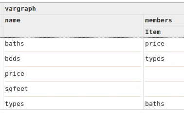
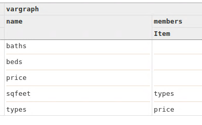
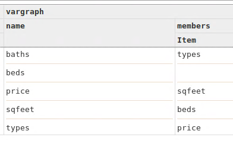

[HOME](https://arungaonkar.github.io/HPCC-Causality/) **|**
[Timeline](https://arungaonkar.github.io/HPCC-Causality/index.html#timeline) **|**
[Previous Week](https://arungaonkar.github.io/HPCC-Causality/week6.html) **|**
[Next Week](https://arungaonkar.github.io/HPCC-Causality/week8.html)

---

# Tuesday 07/05

From the result of conditioned on 1 variable, it can be inferred that

1. price is independent of beds always.
2. price is independent of types given any other variable.
3. price is independent of sqfeet, but when conditioned on baths it is dependent.

After that, I tried to run the conditional dependency test on 2 variables for inferencing the causal model by eliminating the dependencies. But the test was taking too long. After waiting for 6.15 hours, I aborted the test.

I ran causal discovery tests, and it is giving different results on different executions. And the following were the 2 results that were more frequent than the others. One important result is that *price* is the only exogenous variable.

# Wednesday 07/06

While working with gridBundle, I choose to use some snippets from housingMain for debugging purposes. Then I found a bug and error in the housingMain code. I have fixed the bug, and now I can see a change in the causal model.

The resulting causal model can be seen as follows. And in this *beds* is an exogenous variable.

While trying to debug the housingModel in python, I observed that *isIndependent* test in python in *because module* is resulting in *TypeError: 'NoneType' object is not iterable*.

Roger noticed some irregularities in the dataset and found that the dataset is not aligning with the real-world cases like the average prices of the house from the dataset are far different from reality. So I was asked to find another dataset that can be used for the analysis.

# Thursday 07/07 & Friday 07/08

In the Team meeting from 1230-1430, Roger helped me with the gridBundle. I have also reported the bug in *isIndependent* test in the *because* module.

I was looking for any datasets where some reasonable hypotheses can be formed. After looking over more than 100 datasets in Kaggle and trying to make my dataset in WorldBank.org, I found a few datasets, where some real-world hypotheses can be formed, but I think they are not intuitive enough.

---

[HOME](https://arungaonkar.github.io/HPCC-Causality/) **|**
[Timeline](https://arungaonkar.github.io/HPCC-Causality/index.html#timeline) **|**
[Previous Week](https://arungaonkar.github.io/HPCC-Causality/week6.html) **|**
[Next Week](https://arungaonkar.github.io/HPCC-Causality/week8.html)
