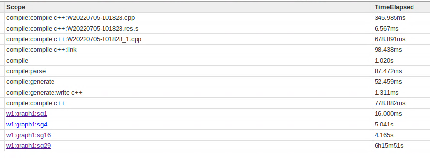
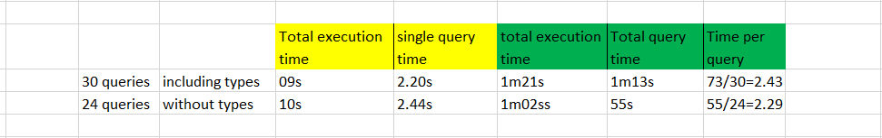

[HOME](https://arungaonkar.github.io/HPCC-Causality/) **|**
[Timeline](https://arungaonkar.github.io/HPCC-Causality/index.html#timeline) **|**
[Previous Week](https://arungaonkar.github.io/HPCC-Causality/week7.html) **|**
[Next Week](https://arungaonkar.github.io/HPCC-Causality/week9.html)

---

# Monday 07/11 & Tuesday 07/12

To apply causality toolkit to real-world dataset, I kept on searching for some more datasets. I have looked at US Accidents dataset, where some of the possible hypothesis were,

1. What will be the effect of weather condition on severity of the accident?
2. How does the side of the lane (left, right) affects the severity of the accident?

But the accident severity was already quantified in the dataset, so discovered inferences will not be much rational enough to draw reasonable conclusions. So I have decided to look at some more datasets.

In the meeting with Roger, we have resolved the *isIndependent* test error in Because module. I have continued testing the *makeGrid* bundle. Till now it seemed fine as there are no issues.

While updating the Because module with recent changes, I have faced the error of missing library installations. Reported to Roger to include sklearn in default installation of packages.

# Wednesday 07/13

For the dependence test for Housing dataset of 1.72 million data rows in the the normalized form, it took around 6hrs, and later which I aborted the test.

So I ran *continuous test* and *mixed test* to check the time taken to execute dependent and independent test for synthetic dataset of the same size. And surprisingly, it was done in less than minutes. In python with Because module, it executed in fraction of a second. So I have decided to look into this issue. Since this issue was noticed after including the labelEncoded data of *types* variable for analysis, I thought of running multiple dependent and independent tests with and without including *types* variable.

After restarting the system and VM, I have observed that this issue is not related to labelEncoding of *types* variable. And to add more surprise, it took 2 minutes to execute the test.

Then the time issue of previous longer test might be due to the assigned Virtual Memory and heap. Assuming so, I tried to increase my VM memory to 16GB and it failed.

I have also kept on looking for some more datasets for possible hypothesis.

# Thursday 07/14 & Friday 07/15

I have received CDC dataset schema from Roger. I have started looking hypothesis from that.

I implemented the makeGrid module for including the three continuous variables. To integrate this with the discrete variables, I have to use the isDiscrete and histogram from the probability distribution of those variable. I am trying to extract the required details from the distribution but not able to do exactly.

I have also started analyzing the CDC dataset schema and looked at the real dataset for details. After that I started cleaning the data and preparing for analysis.

---

[HOME](https://arungaonkar.github.io/HPCC-Causality/) **|**
[Timeline](https://arungaonkar.github.io/HPCC-Causality/index.html#timeline) **|**
[Previous Week](https://arungaonkar.github.io/HPCC-Causality/week7.html) **|**
[Next Week](https://arungaonkar.github.io/HPCC-Causality/week9.html)
