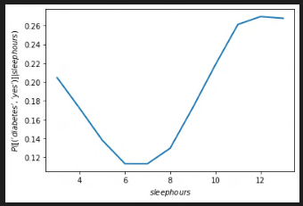
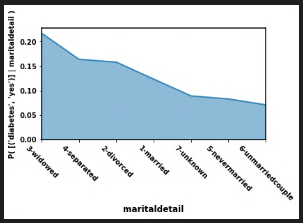
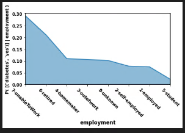
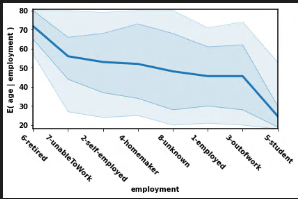
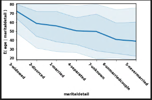
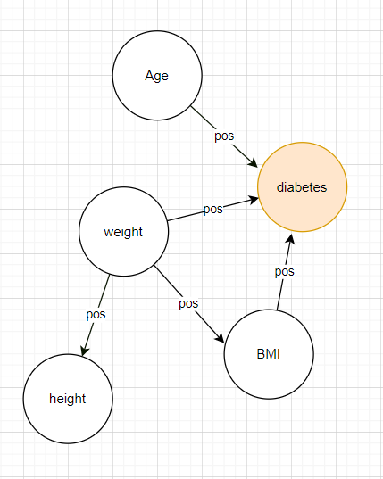

[HOME](https://arungaonkar.github.io/HPCC-Causality/) **|**
[Timeline](https://arungaonkar.github.io/HPCC-Causality/index.html#timeline) **|**
[Previous Week](https://arungaonkar.github.io/HPCC-Causality/week8.html) **|**
[Next Week](https://arungaonkar.github.io/HPCC-Causality/week10.html)

---

# Monday 07/18 & Tuesday 07/19

From the dataset of 279 columns, I have selected a total of 29 columns for analysis. After preprocessing the dataset is of size (301667, 29).

I have Started analyzing the data. I have found some outliers like weight over 776 pounds and few in Income category as well. I have applied filters to remove them.

I have also faced an error with read_sas [bug 30051](https://github.com/pandas-dev/pandas/issues/30051) of an XPT file, a temporary fix has been used as mentioned in the link.

From the dataset, I have made some observations like:

1. Probability distribution of female weight is multi-modal,(unlike with female height, male height and male weight) which is not expected.
2. Male have higher weight than female of same age and height, which also have been scientifically proven.
3. As the height increased, probability of diabetes decreases but the rate of decrease is not significant. In Male. it'll start increasing again at 75 and for female it is at a height of 70 inch.

# Wednesday 07/20

I have continued to analyze the data for some patterns. Some of the observations are:

1. Diabetes conditioned on BMI, controlled for height is same as diabetes conditioned on BMI without controlled for height. But when controlled with weight, the graph seems very much disturbed.

2. In diabetes vs bmicategory - for underweight people, diabetes was 1 (no diabetes). but when controlled with height, Diabetes of underweight people found to be yes. And the result remained same for all others. What could be the inference from this?

When doing a test I found a potential bug. *invalid value in true_divide (line 1138 prob.py)*

3. As income increases the probability of diabetes decreases. In order to understand this I started to find the relationship of income and other factors that can affect the probability of diabetes.

4. Even though it is not significant, but as number of drinks per day increased the probability of diabetes decreased. And from Income vs drinking, I was not able to find any relationship.

5. If there are any physical activity, then the probability of diabetes decreases. This seems to align with the real-world analysis as well.

6. the probability of diabetes is low if a person is having necessary amount of sleep.i.e., from 6-7 hours per day. And if the probability of diabetes increases as it deviates from this range.

    

# Thursday 07/21 & Friday 07/22

I have made some more progress on analyzing the data and found few more patterns.

In the dataset I have found that the calculated BMI values are somewhat off. So I have decided to recalculate using the formula:

```text
bmi = weight * 703 / height^2.
```

The number of drinks per day that I have used has some type of encoding, which could not be used for analysis as it is. So I have used few other variables to calculate the drinks. And it represents the number of days a person had drinks in a month.

Few inferences from the graph are:

1. Given a particular age, the probability of diabetes increases with the weight, but only after the age of 30. From the age 18-30, diabetes seems independent of the age and weight. And for a particular age, the height does not seem to affect the probability of diabetes. It can explained by the factor that height stops increasing after a particular age, but not the weight.

2. When I tried diabetes | bmi, weight, the graph is pretty much as expected. As the weight increased, BMI  also increased, showing the direct dependency of BMI and weight. And as both increased, the probability of diabetes also increased.

But with diabetes | bmi and height: as the height increased, BMI was supposed to decrease, according to the formula. But here, change in height is not affecting the BMI. So the probability of diabetes is increasing as BMI increased. This analysis points in a direction that the BMI is independent of the height. And also the negative correlation that has been observed between BMI and height, was not observed in this plot.

3. People aged 35 and above, with higher income tend to have lesser probability of diabetes. But this is not for the people with the aged below 35. As people of this age have very less chance of diabetes.

    

4. From the below graph, it can be observed that students are least likely to expect a diabetes. This is the expected behavior as the students are usually aged under 35. And from the graph below, the expected age of student is 25. And from Diabetes vs Age, it has been observed that diabetes for age under 30 is very less likely expected.

    

    

5. From the graph below it can be observed that, the expected a person is who is never married is 38. and the age of unmarried couple is 40 and those of separated couple is 50. It can be also seen that people usually get married at 55 and widowed at the age off 72. It is also noticed that divorcing age of the people is around 60. From the graph it looks like, there is a slow gradual trend as the age and marital status.

    

From the above hypotheses and observation, the following causal diagram can be drawn.



---

[HOME](https://arungaonkar.github.io/HPCC-Causality/) **|**
[Timeline](https://arungaonkar.github.io/HPCC-Causality/index.html#timeline) **|**
[Previous Week](https://arungaonkar.github.io/HPCC-Causality/week8.html) **|**
[Next Week](https://arungaonkar.github.io/HPCC-Causality/week10.html)
